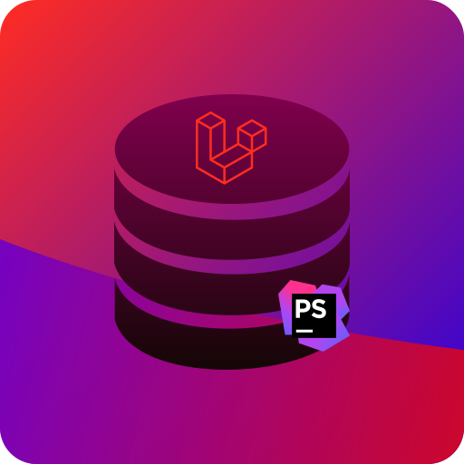

# Laravel Query

<!-- Plugin description -->
## Laravel + DataGrip = ♥️

This plugin provides database integration for Laravel query builder.

**Don't forget to connect your database in order for this to work.**
See <https://www.jetbrains.com/help/phpstorm/connecting-to-a-database.html#connect-to-mysql-database> for instructions.

* Schemas, tables, views and columns completion for query builder methods
* Inspection of unknown database elements
* Table alias support
* Table name resolving from model for eloquent builder methods
* Model relation table name resolving for eloquent builder relation closure methods
* Text linking with database elements for navigation and refactoring

<!-- Plugin description end -->

## Future plans

* Support for Schema builder
* Dynamic nested levels support (in closures)
* Support for queries inside model scope methods
* Improve sorting

## Installation

- Using IDE built-in plugin system:
  
  <kbd>Preferences</kbd> > <kbd>Plugins</kbd> > <kbd>Marketplace</kbd> > <kbd>Search for "Laravel Query"</kbd> >
  <kbd>Install Plugin</kbd>
  
- Manually:

  Download the [latest release](https://github.com/ekvedaras/laravel-query-intellij/releases/latest) and install it manually using
  <kbd>Preferences</kbd> > <kbd>Plugins</kbd> > <kbd>⚙️</kbd> > <kbd>Install plugin from disk...</kbd>

## Template ToDo list
- [x] Create a new [IntelliJ Platform Plugin Template][template] project.
- [x] Verify the [pluginGroup](/gradle.properties), [plugin ID](/src/main/resources/META-INF/plugin.xml) and [sources package](/src/main/kotlin).
- [x] Review the [Legal Agreements](https://plugins.jetbrains.com/docs/marketplace/legal-agreements.html).
- [ ] [Publish a plugin manually](https://www.jetbrains.org/intellij/sdk/docs/basics/getting_started/publishing_plugin.html) for the first time.
- [ ] Set the Plugin ID in the above README badges.
- [ ] Set the [Deployment Token](https://plugins.jetbrains.com/docs/marketplace/plugin-upload.html).
- [x] Click the <kbd>Watch</kbd> button on the top of the [IntelliJ Platform Plugin Template][template] to be notified about releases containing new features and fixes.

---
Plugin based on the [IntelliJ Platform Plugin Template][template].

[template]: https://github.com/JetBrains/intellij-platform-plugin-template
